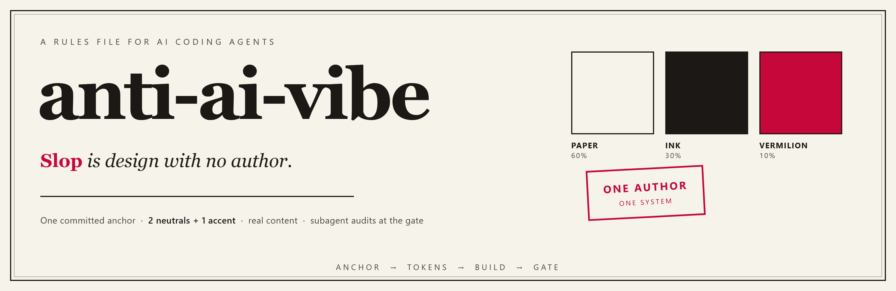
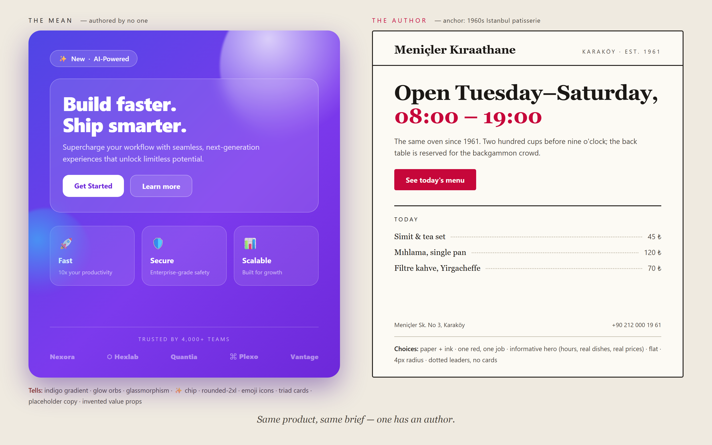

<div align="center">



<br>

**A rules file for AI coding agents.**
It stops your agent from shipping the statistical average of its training data — the purple gradient, the glassmorphism, the 500-line function — and makes it produce design, code, and 3D with a visible author.

`SKILL.md` · works in ZCode, Claude Code, or any agent that reads markdown rules

<br>



*Same brief, same product. One has an author.*

</div>

---

## Three moves, before any design or code

<div align="center">

**1 · Anchor** — one concrete sentence naming a place, era, or material.
*"1960s Istanbul patisserie: glazed tile, marble, brass."* "Modern" and "minimal" are banned — they're the average wearing a blazer.

**2 · Tokens** — 2 neutrals + 1 accent with real hex values, one spacing scale, one radius, one motion policy. Written once, obeyed everywhere — page and 3D scene alike.

**3 · Real content** — named people, real dates, real prices. A placeholder is a design smell, not a starting point.

</div>

Everything else is enforcement: [audit.md](references/audit.md) holds the full tell checklists with severities, [palette.md](references/palette.md) the color construction, [code.md](references/code.md) the team doctrine, [3d.md](references/3d.md) the scene rules.

## Install

```bash
# ZCode / cross-agent location
cp SKILL.md ~/.agents/skills/anti-ai-vibe/SKILL.md
cp -r references scripts assets ~/.agents/skills/anti-ai-vibe/

# Claude Code
cp SKILL.md .claude/skills/anti-ai-vibe/SKILL.md
```

Copy the whole folder — the skill is small but not single-file anymore: it ships reference checklists, a WCAG contrast script, and a commented token sheet.

## The gate: subagent audits, not vibes

Every UI-bearing PR, page, or scene passes through three parallel auditor subagents before it ships. Each returns machine-readable verdicts; the synthesizer blocks on severity-3 tells and on *signatures* — one match is noise, ten matches is a signature.

| Auditor | Reads | Blocks on |
|---|---|---|
| **visual** | rendered PNGs vs [audit.md §Visual](references/audit.md) | gradient heroes, triad cards, placeholder copy, logo soup |
| **code** | the diff vs [audit.md §Code](references/audit.md) | defensive theater, speculative abstraction, unread code |
| **contrast** | `scripts/contrast-check.mjs` on token pairs | anything below WCAG AA |

```bash
node scripts/contrast-check.mjs "#1B1B1F on #F3EFE7" "#7E5A1E on #F3EFE7"
# 1B1B1F on F3EFE7  14.97  AA +AAA
# 7E5A1E on F3EFE7  5.44   AA
```

## Built for corporate work

<details>
<summary><b>Design system exists?</b> The skill switches to enforcement mode — never re-themes a brand.</summary>

<br>

Phase 0 harvests your existing tokens, theme configs, and brand assets first (an Explore subagent sweeps the repo). With a system in place, the skill enforces it: tokens namespaced (`--brand-*` / `--sys-*`), no raw hex in components (lint-enforced), dark mode as a second semantic layer instead of neon-on-black, i18n-safe copy, and decisions recorded in a one-page system sheet committed to the repo.

Start from [`assets/design-tokens.example.css`](assets/design-tokens.example.css) — a complete commented sheet with light/dark themes and the three token layers.

</details>

<details>
<summary><b>The full tell list</b> — 45 rules with severities, from indigo gradients to slopsquatting</summary>

<br>

Read [references/audit.md](references/audit.md). Color, typography, layout, surfaces, icons, copy, code, and 3D — each rule with evidence and a severity (1 drift · 2 tell · 3 banned default), the verdict JSON schema auditors return, and the remediation order with the highest-impact fix first.

</details>

<details>
<summary><b>Sources</b> — where the rules were reverse-distilled from</summary>

<br>

Live HTML/CSS teardowns of six human-feeling sites ([Scratch](https://scratch.mit.edu/ideas), [NASA Space Apps](https://www.spaceappschallenge.org/), [TUA](https://tua.gov.tr/tr), [Mürekkep](https://www.murekkep.com.tr/), [Elele](https://eleleegitim.org/), [Scratch Foundation](https://www.scratchfoundation.org/donate)) plus: [signs-of-ai-design](https://github.com/febbhav/signs-of-ai-design) · [the purple-gradient analysis](https://prg.sh/ramblings/Why-Your-AI-Keeps-Building-the-Same-Purple-Gradient-Website) · [Spot the Slop](https://www.mania.design/blog/spot-the-slop-a-ui-designers-guide-to-fixing-ai-defaults/) · [GitClear code quality reports](https://www.gitclear.com) · [arXiv:2411.07858](https://arxiv.org/html/2411.07858v1) · [NN/g on color](https://www.nngroup.com/articles/color-enhance-design) · Ousterhout's *Philosophy of Software Design* · Gabriel's *Worse Is Better* · Pike's *Simplicity is Complicated*.

</details>

---

<div align="center">

<em>Don't remove the purple. Remove the average — concretize, constrain, fill with the real thing.</em>

<br>

[MIT](LICENSE) · the README you just read was designed by the skill it documents

</div>
